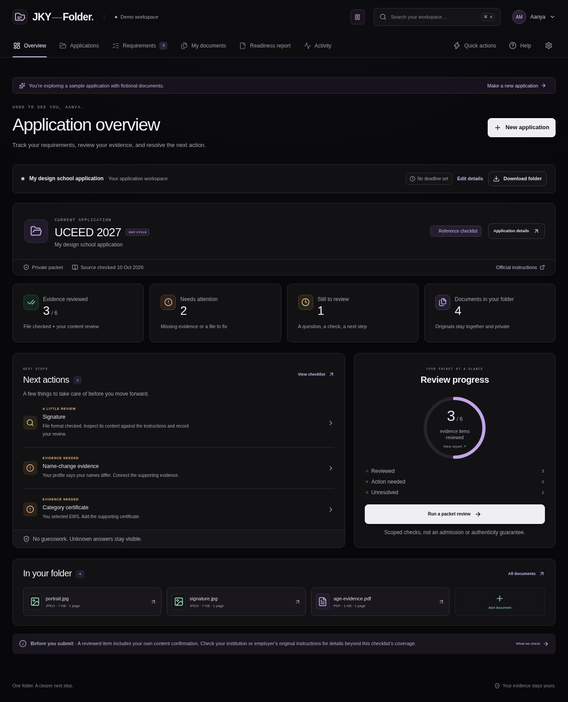

# JKY-Folder

**Application instructions. Supporting documents. A clear next step.**

A working local application for preparing college, scholarship and job document folders. Create an application from an editable starter or your actual instructions, bring original files together, connect evidence to pages, and save a report of missing documents and unresolved checks.



## Run it locally

Requires **Node.js 22.12+**.

```sh
npm ci
npm run dev
```

Open **http://127.0.0.1:5173** and choose **Explore the demo**. The demo has fictional documents, an isolated account and a real working review workflow. You can also create your own adults-only development account. Use synthetic documents while public launch gates remain open.

## What works

- Account registration, sign-in, display-name updates, password changes, session revocation and account deletion.
- A dark, responsive workspace with top navigation, account menus, first-use guidance and distinct checklist, document and report sections.
- An interactive welcome page, floating packet illustration, pointer-responsive cards, animated progress/counters and scroll reveals.
- Searchable quick actions, visible file-drop feedback, keyboard navigation, persistent pause controls and system reduced-motion support.
- An application portfolio with real progress counts, search, sorting, deadlines, archive and restore.
- College, scholarship, job and custom checklist starters; instruction-line import and editable requirements.
- Optional items, profile conditions, file formats, custom size limits and literal text checks on linked PDF pages.
- A versioned UCEED 2027 reference checklist with explicit unknown profile answers.
- Private PDF/JPEG intake with per-file batch results, bounded asynchronous inspection, retries and duplicate detection.
- Actual PDF page previews with pagination and zoom, page-text extraction, JPEG previews and private original downloads.
- Requirement-to-document/page evidence links and clearly labelled personal review notes.
- Conservative technical checks, missing evidence, unknown applicability and review-needed states.
- Versioned review snapshots, stale-report notices, JSON exports, printable reports and private ZIP folder downloads.
- Application URLs that retain the selected section on refresh and support browser Back/Forward.
- Search across requirements and extracted document text, filters, real account activity, help and privacy controls.
- Deletion of active documents, extracted pages, links, jobs, reports and account sessions.

**A reviewed item is not a guarantee of authenticity, eligibility or institutional acceptance.** Starters are editable organizing suggestions, not official application rules. Instruction import creates one item per nonempty line; you confirm its meaning and conditions. The UCEED pack is a limited reference, not an independently approved complete official checklist. Scanned PDFs require manual review; OCR and automatic certificate judgments are not implemented.

## Verify the application

```sh
npm run check
npx playwright install chromium
npm run test:e2e
```

The verification suite has **39 domain/API/worker tests** and **24 desktop/mobile browser checks**, plus TypeScript and the client build. It covers real PDF upload/extraction/rendering, mixed upload batches, duplicates, custom instructions and checklist changes, private ZIP bytes, account password/session controls, application navigation, evidence review, historical reports, deletion, keyboard focus, top navigation, quick actions, real file drops, account-menu interaction, interactive workflow tabs, persistent animation controls, reduced motion and automated accessibility across core screens and dialogs. Browser tests use isolated ports and disposable synthetic accounts, independent of your personal local data. The dependency audit reported no known vulnerabilities at this review; it is a dated check, not a permanent assurance.

GitHub Actions runs the checks on pushes and pull requests and retains browser failure traces for seven days. Application source can be formatted with `npm run format`.

## Architecture and boundaries

React + TypeScript + Vite client; Express API; SQLite metadata; private filesystem originals; durable document jobs and a separate inspection process. Data lives in the ignored `.data` directory and is never a public asset. The current runtime is intended for a **local single-instance development release**.

Read the [runbook](docs/engineering/RUNBOOK.md), [implementation status](docs/engineering/IMPLEMENTATION_STATUS.md), [release gates](docs/engineering/RELEASE_GATES.md) and [security notes](SECURITY.md) before operating it. Production hosting, reviewed rule-pack completeness, managed storage, hardened isolation, recovery operations, legal review, paid-demand validation and payment processing remain required startup work.

This implementation has not been publicly deployed or certified as ready for real sensitive applicant documents.

## Preview and startup plan

[Motion preview](docs/engineering/previews/interactions.webm) · [Quick actions](docs/engineering/screenshots/quick-actions.png) · [Interactive workflow](docs/engineering/screenshots/workflow-preview.png) · [Welcome page](docs/engineering/screenshots/landing.png) · [First-use workspace](docs/engineering/screenshots/welcome.png) · [Application setup](docs/engineering/screenshots/application-setup.png) · [Application portfolio](docs/engineering/screenshots/applications.png) · [PDF preview](docs/engineering/screenshots/pdf-preview.png) · [Mobile workspace](docs/engineering/screenshots/mobile.png) · [Original logo concept](docs/brand/jky-folder-logo-concept.png)

The original **29,354-line startup implementation plan** remains preserved as a dated specification across the [master plan](IMPLEMENTATION_PLAN.md) and six detailed volumes. It contains 96 workstreams, 576 deliverables and 2,304 acceptance situations. Implementation references are mapped in the release-gate document; business and expansion deliverables are not marked complete by the existence of code.

| Volume | Subject |
| --- | --- |
| [01](docs/plan/01-strategy-product-brand.md) | Strategy, discovery, product experience and brand |
| [02](docs/plan/02-requirements-documents-evidence.md) | Requirements, conditional rules, documents and evidence |
| [03](docs/plan/03-architecture-data-delivery.md) | Architecture, contracts, persistence and delivery |
| [04](docs/plan/04-trust-privacy-quality.md) | Security, privacy, evaluation and release assurance |
| [05](docs/plan/05-operations-pricing-launch.md) | Operations, pricing, launch and customer support |
| [06](docs/plan/06-roadmap-growth-governance.md) | Roadmap, growth, expansion and governance |

[Research sources](docs/SOURCES.md) · [Brand brief](docs/brand/LOGO_BRIEF.md)

Repository owner and sole author of publication commits: **kartikeyajay2006**.
