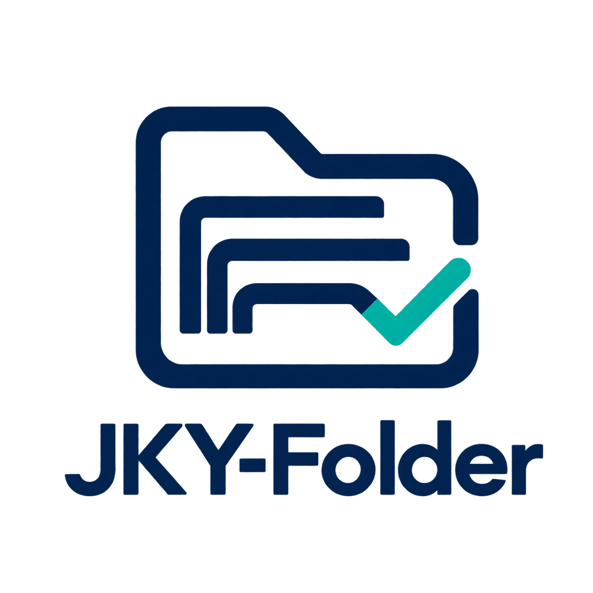

# JKY-Folder

**Check whether your application documents are ready against the actual instructions.**

This repository contains a startup implementation plan and an original logo concept. All capabilities, checks, staffing, budgets and milestones described here are proposed work. There is no application implementation in this repository.

Start with the [master implementation plan](IMPLEMENTATION_PLAN.md). It sets scope, architecture decisions, launch gates, costs and sequencing. The six volumes expand the work into deliverables and acceptance situations.

| Volume | Subject |
| --- | --- |
| [01](docs/plan/01-strategy-product-brand.md) | Strategy, discovery, product experience and brand |
| [02](docs/plan/02-requirements-documents-evidence.md) | Requirements, conditional rules, documents and evidence |
| [03](docs/plan/03-architecture-data-delivery.md) | Architecture, contracts, persistence and delivery |
| [04](docs/plan/04-trust-privacy-quality.md) | Security, privacy, evaluation and release assurance |
| [05](docs/plan/05-operations-pricing-launch.md) | Operations, pricing, launch and customer support |
| [06](docs/plan/06-roadmap-growth-governance.md) | Roadmap, growth, expansion and governance |

Read the [research sources](docs/SOURCES.md) for dated observations and the [logo brief](docs/brand/LOGO_BRIEF.md) for the design rationale and future clearance work.

Planning baseline: **9 October 2026**. Historical UCEED 2026 instructions are a reference case. A live application cycle requires newly reviewed official instructions.

Repository owner and sole author of the requested publication commits: **kartikeyajay2006**.
