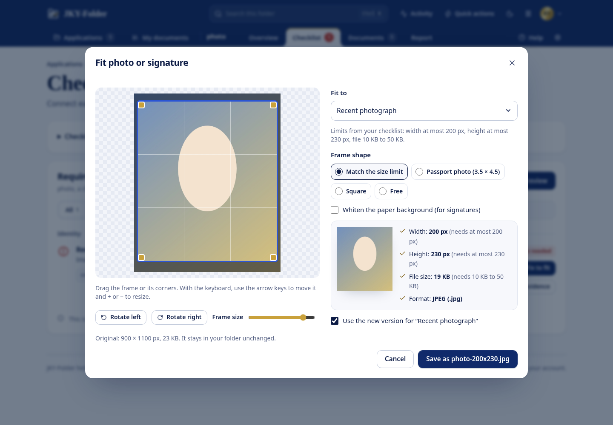
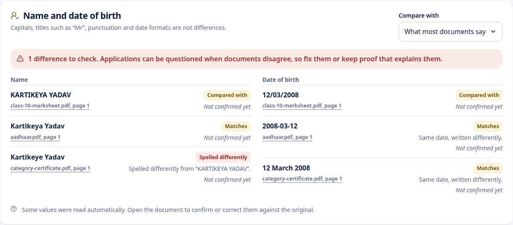
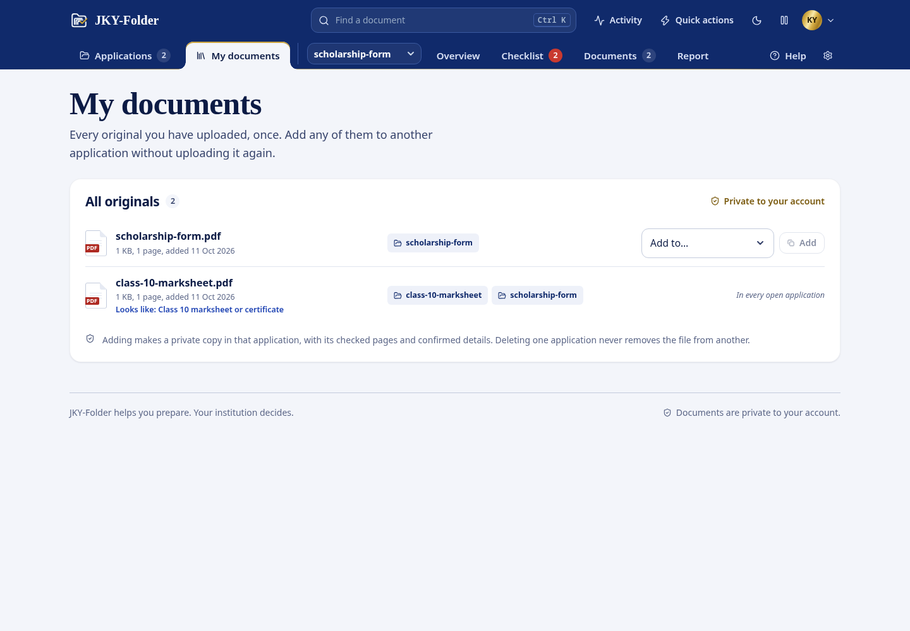
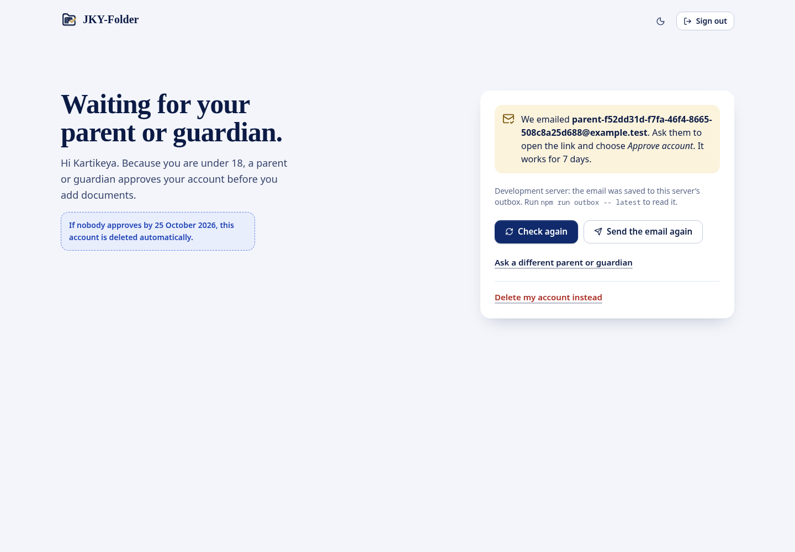
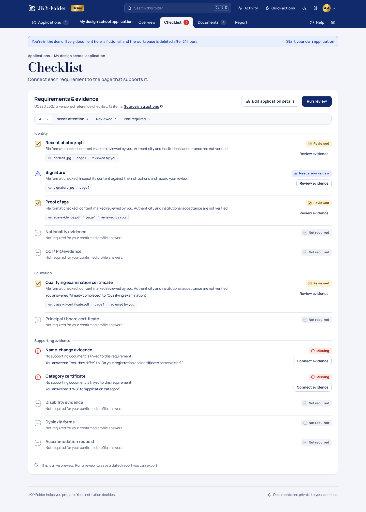
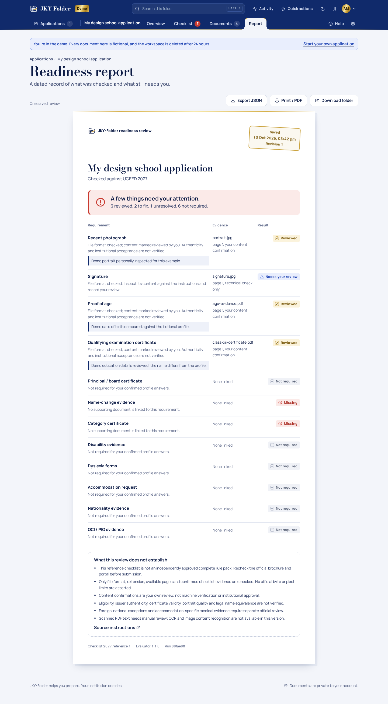
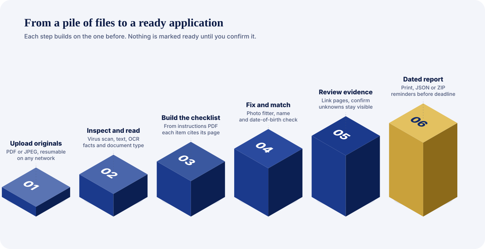
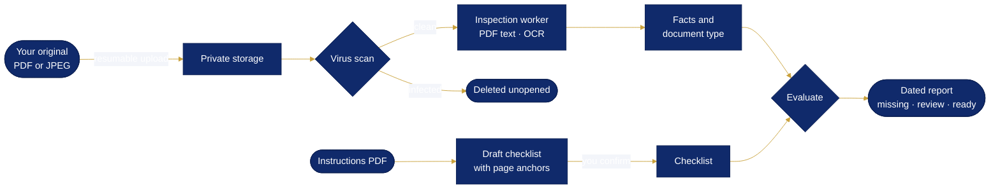
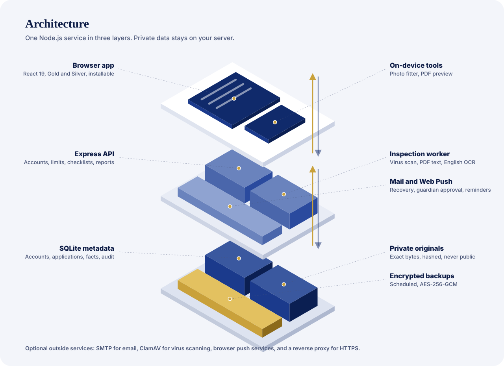
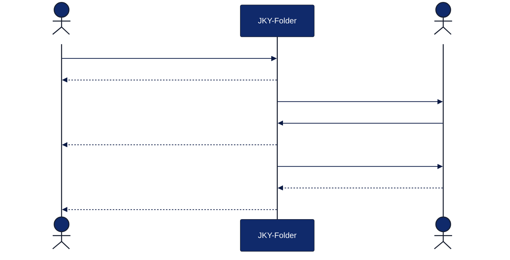

<p align="center">
  
</p>

<p align="center">
  <a href="https://github.com/kartikeyajay2006/JKY-Folder/actions/workflows/ci.yml"></a>
  
  
  
  
  
</p>

<p align="center">
  <b>JKY-Folder</b> helps students in India prepare the documents for college, scholarship and job applications.<br />
  Upload your originals, turn the institution’s instructions into a checklist, fix what portals reject, and see exactly what is still missing.
</p>

---

## What it does

| | |
| --- | --- |
| **Checklist from the instructions PDF** | Every requirement is drafted with the page it came from. You confirm each one. |
| **Photo and signature fixer** | Crop, rotate and compress a JPEG to the portal’s exact pixel and KB limits, in the browser. |
| **Name and date-of-birth check** | Finds spelling, initials, missing middle names and swapped dates across your documents. |
| **Upload once, use everywhere** | One library of originals, added to any application without uploading again. |
| **Knows what a document is** | “Looks like: Aadhaar card”, so the right file goes to the right checklist item. |
| **Under-18 friendly** | A parent or guardian approves the account by email, and can withdraw at any time. |
| **Works on bad networks** | Uploads resume from the last saved piece; the app installs on your phone. |
| **Never miss a deadline** | Reminders by email and browser notification, even with the app closed. |

<details>
<summary><b>See it</b> (screenshots)</summary>
<br />

| Landing, Gold | Workspace, Silver |
| --- | --- |
|  |  |
| **Photo and signature fixer** | **Name and date of birth** |
|  |  |
| **My documents** | **Waiting for a guardian** |
|  |  |
| **Checklist** | **Report** |
|  |  |

</details>

## How it works

<p align="center"></p>



Nothing becomes “ready” on its own: unknown answers, unread pages and unconfirmed facts stay visible until you check them against the original.

## Architecture

<p align="center"></p>

<details>
<summary><b>Under-18 approval, step by step</b></summary>



</details>

| Layer | Built with |
| --- | --- |
| Browser | React 19, TypeScript, Vite, PDF.js, canvas image processing, installable web app |
| Server | Node.js 22, Express 5, zod validation, helmet, per-session rate limits, CSRF tokens |
| Workers | Separate inspection process (PDF.js text, Tesseract English OCR), ClamAV scanning, mail and Web Push queues |
| Data | SQLite metadata, private content-hashed originals, encrypted backups, deletion ledger |

## Get started

```sh
npm ci
npm run dev
```

Open **http://127.0.0.1:5173**, then choose **Explore the demo** (fictional documents) or create an account. Emails such as password resets and guardian approvals go to a local outbox in development; read the newest with `npm run outbox -- latest`.

Requires **Node.js 22.12 or newer**. Use synthetic documents until the public launch checks below are complete.

## Put it online

```sh
cp .env.example .env            # set APP_ORIGIN, SMTP and BACKUP_PASSWORD
DOMAIN=jkyfolder.example docker compose --profile https --profile scan up -d
```

That runs the app with automatic HTTPS and virus scanning on any small server. On Render, create a **Blueprint** from this repository ([`render.yaml`](render.yaml)). Details: [deployment guide](docs/engineering/DEPLOY.md).

## Quality

```sh
npm run check        # TypeScript, 462 unit and API tests, production build
npm run test:e2e     # 60 desktop and mobile browser journeys with accessibility scans
```

Every push runs both in GitHub Actions. Browser tests cover real uploads and OCR, interrupted uploads, the photo fixer, guardian approval through the outbox, both themes, keyboard use, phone widths and automated WCAG 2.1 AA scans.

## Project map

```
src/        Browser app: views, components, photo fitting, themes and motion
server/     API, inspection jobs, uploads, mail, push, guardian approval, backups, scanning
shared/     Checklist evaluation, fact extraction, name/date matching, document types
tests/      Unit/API tests and Playwright browser journeys
docs/       Engineering contracts, operations runbook, startup plan and brand
```

## Documentation

| Read this | For |
| --- | --- |
| [Every feature](docs/engineering/FEATURES.md) | The complete list of what works today |
| [Applicant tools](docs/engineering/APPLICANT_TOOLS.md) | Photo fixer, under-18 approval, name/date check, My documents |
| [Deployment](docs/engineering/DEPLOY.md) | Docker, Render, HTTPS, backups, virus scanning |
| [Runbook](docs/engineering/RUNBOOK.md) | Running, checking and recovering the service |
| [Intake and recovery](docs/engineering/INTAKE_AND_RECOVERY.md) · [Email](docs/engineering/ACCOUNT_EMAIL.md) · [Review engine](docs/engineering/REVIEW_ENGINE.md) | Contracts behind uploads, mail and evaluation |
| [Release gates](docs/engineering/RELEASE_GATES.md) · [Status](docs/engineering/IMPLEMENTATION_STATUS.md) · [Security](SECURITY.md) | What is done and what must happen before public launch |
| [Startup plan](IMPLEMENTATION_PLAN.md) | 96 workstreams across strategy, product, trust, operations and growth |

## Before public launch

The software is complete for a private pilot. These need people rather than code:

- An independent reviewer signs off the UCEED checklist and the correctness test answers (offline review workbooks are ready).
- A lawyer reviews privacy, the under-18 policy and the terms; an outside tester runs a security review.
- Real SMTP credentials, a domain and hosting; then a pilot with real students.

A reviewed item means the file checks passed and you confirmed the content yourself. It is never a guarantee of authenticity, eligibility or acceptance; your institution decides.

<p align="center"><sub>Built and maintained by <b>kartikeyajay2006</b>.</sub></p>
