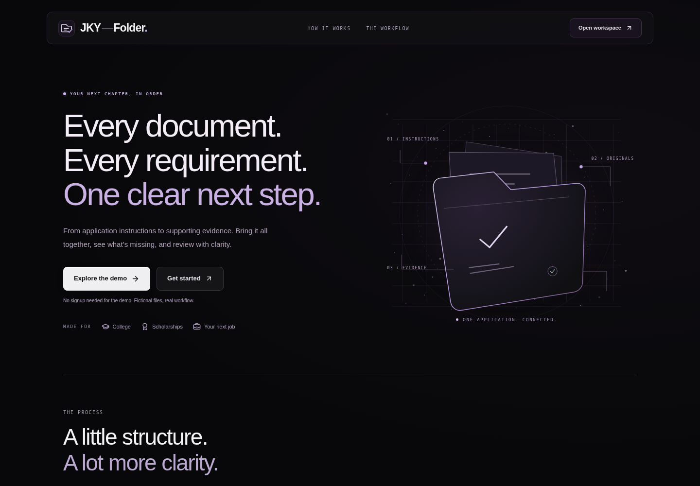
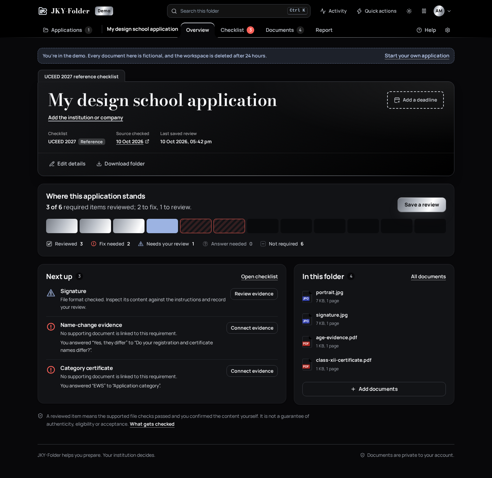

# JKY-Folder

**Application instructions. Supporting documents. A clear next step.**

A working local application for preparing college, scholarship and job document folders. Upload your original files to start a folder. Its checklist contains only those files. You can explicitly add your actual application instructions later, connect evidence to pages, and save a dated review.



| Gold (light) | Silver (dark) |
| --- | --- |
|  |  |

## Run it locally

Requires **Node.js 22.12+**.

```sh
npm ci
npm run dev
```

Open **http://127.0.0.1:5173** and choose **Explore the demo**. The demo has fictional documents, an isolated account and a real working review workflow. You can also create your own adults-only development account. Use synthetic documents while public launch gates remain open.

## What works

New accounts show an upload entry. Application folders and document/checklist/report navigation appear after files are supplied; reports are saved only when you run a review. No starter or reference checklist is selected automatically. Empty folders are hidden from navigation, and removing the last file returns to the upload entry.

- Account registration, sign-in, display-name updates, password changes, session revocation and account deletion.
- Two themes of three colours each: **Gold** (white, royal blue, gold leaf) and **Silver** (black, white, brushed silver). They follow the device or a saved choice, switch with a circular reveal, and every colour pair meets WCAG AA.
- A workspace organised like a physical file: index-tab navigation, an application "file cover" with a deadline stamp, a per-item checklist strip instead of a single readiness score, a grouped checklist ledger, a folder-pocket drop zone and a printable, stamped report.
- An interactive landing page whose example folder is built from the real reference checklist, with one orchestrated intro (3D folder, drawn ticks, an embossed seal) and scroll reveals.
- Motion that answers actions: sliding tabs and page transitions, metallic sheen and pointer glare, skeleton loaders, toast timers. A persistent pause control and system reduced-motion stop all of it.
- A command palette (Ctrl + .) that searches actions, checklist items, documents and applications; files dropped on any page go to the current application; toasts offer the next step.
- No hard-coded product data in the browser: limits, profile questions, conditions, starters and reference checklists come from the public `/api/catalog`, and packet details include the server-resolved checklist and live evaluation.
- An application portfolio with real progress counts, search, sorting, deadlines, archive and restore.
- College, scholarship, job and custom checklist starters; instruction-line import and editable requirements.
- Optional items, profile conditions, file formats, custom size limits and literal text checks on linked PDF pages.
- A versioned UCEED 2027 reference checklist with explicit unknown profile answers.
- Private PDF/JPEG intake with per-file batch results, bounded asynchronous inspection, retries and duplicate detection.
- Actual PDF page previews with pagination and zoom, page-text extraction, JPEG previews and private original downloads.
- Requirement-to-document/page evidence links, multiple reviewed components or accepted alternatives, and clearly labelled personal review notes.
- Source snapshot hashes, exact obligation anchors, a curator draft/review/publication workflow and visible source-change handling.
- Structured fact confirmation, manual transcription, immutable correction history and confirmed-value comparison.
- Requirement-specific size, page, image-dimension and confirmed-date checks.
- Local English OCR for image-only PDF pages and JPEGs, with coordinates, confidence, uncertainty warnings and conservative evidence suggestions.
- Resumable uploads: originals travel in saved 512 KB chunks; a dropped connection retries with backoff, waits out offline periods and continues from the last saved chunk by itself. Unfinished uploads are listed with how much is saved, and the same file finishes from any tab or device within 24 hours.
- Instructions PDF to draft checklist: proposals with exact page anchors, joined wrapped lines, document lists under headings, size/pixel/page/format limits read from the wording and suggested conditions (for example "SC/ST candidates"). Review shows the source page beside each proposal; nothing is activated until you decide every item and confirm.
- Password recovery and email verification with single-use, 30-minute links, plus emailed reminders through a background worker. Without SMTP, `MAIL_TRANSPORT=outbox` saves the emails locally so recovery can be tried in development.
- Reminders on closed browsers through Web Push (RFC 8291/8292, built-in crypto): turn notifications on per device, send a test, and receive generic deadline and source-change notices with no titles or file names on the lock screen.
- Contact support from Help without sending documents: urgent wrong-result and privacy reports are prioritised, and sharing an application with support is opt-in, limited to 24 or 72 hours, revocable and recorded in your activity.
- Offline review workbooks for the independent reviewer of a rule pack and for blind benchmark labelling; their downloads are verified by the existing review and adjudication commands.
- Private in-app deadline/source reminders and preferences, and rate limits per signed-in session so people on a shared network are not blocked by each other.
- Encrypted local backups, exact-object integrity checks and post-backup deletion replay on restoration.
- Conservative technical checks, missing evidence, unknown applicability and review-needed states.
- Versioned review snapshots, stale-report notices, JSON exports, printable reports and private ZIP folder downloads.
- Application URLs that retain the selected section on refresh and support browser Back/Forward.
- Search across requirements and extracted document text, filters, real account activity, help and privacy controls.
- Deletion of active documents, extracted pages, facts, links, jobs, reports and account sessions; recovery replays deletion records.

**A reviewed item is not a guarantee of authenticity, eligibility or institutional acceptance.** Starters are editable organizing suggestions, not official application rules. Instruction import creates one item per nonempty line; you confirm its meaning and conditions. The UCEED pack is a limited reference, not an independently approved complete official checklist. English OCR is a reading aid; uncertain scans and unsupported languages require manual review. Automatic certificate judgments are not implemented.

## Verify the application

```sh
npm run check
npx playwright install chromium
npm run test:e2e
```

The verification suite has **437 domain/API/worker/benchmark tests** and **50 desktop/mobile browser checks** (the two offline reviewer workbooks run on desktop only), plus TypeScript and the client build. It covers real PDF upload/extraction/rendering, uploads that recover from dropped connections, offline periods and reloads, instructions-PDF drafting and review, password reset through the development outbox, Web Push encryption and VAPID signing against the RFC formats, support requests with time-limited access, reviewer workbooks whose downloads pass the real review and adjudication gates, mixed upload batches, duplicates, custom instructions and checklist changes, private ZIP bytes, account password/session controls, application navigation, evidence review, historical reports, deletion, keyboard focus, top navigation, quick actions, real file drops, account-menu interaction, the example folder's keyboard tabs, persistent animation controls, reduced motion, light/dark themes, drop-anywhere intake, palette search, phone-width overflow against the visual viewport, and automated accessibility across core screens and dialogs in both themes. Browser tests run desktop and mobile against separate fresh servers, using isolated ports and disposable synthetic accounts independent of your personal local data. This keeps the expanded suite below the normal per-server authentication limits. The dependency audit reported no known vulnerabilities at this review; it is a dated check, not a permanent assurance.

GitHub Actions runs the checks on pushes and pull requests and retains browser failure traces for seven days. Application source can be formatted with `npm run format`.

## Architecture and boundaries

React + TypeScript + Vite client; Express API; SQLite metadata; private filesystem originals; durable document jobs and a separate inspection process. Data lives in the ignored `.data` directory and is never a public asset. The current runtime is intended for a **local single-instance development release**.

Read the [review-engine contracts](docs/engineering/REVIEW_ENGINE.md), [runbook](docs/engineering/RUNBOOK.md), [implementation status](docs/engineering/IMPLEMENTATION_STATUS.md), [release gates](docs/engineering/RELEASE_GATES.md) and [security notes](SECURITY.md) before operating it. Production hosting, independently reviewed rule-pack completeness, managed storage, hardened isolation, automated offsite recovery operations, legal review, paid-demand validation and payment processing remain required startup work. The 312 author-labelled critical-negative cases are internal regression evidence; independent held-out benchmark adjudication remains open.

This implementation has not been publicly deployed or certified as ready for real sensitive applicant documents.

## Preview and startup plan

[Motion preview](docs/engineering/previews/interactions.webm) · [Landing, Silver](docs/engineering/screenshots/landing-silver.png) · [Example folder](docs/engineering/screenshots/workflow-preview.png) · [Checklist](docs/engineering/screenshots/checklist.png) · [Report](docs/engineering/screenshots/report.png) · [Quick actions](docs/engineering/screenshots/quick-actions.png) · [First-use workspace](docs/engineering/screenshots/welcome.png) · [Application setup](docs/engineering/screenshots/application-setup.png) · [Application portfolio](docs/engineering/screenshots/applications.png) · [PDF preview](docs/engineering/screenshots/pdf-preview.png) · [Mobile workspace](docs/engineering/screenshots/mobile.png) · [Sign-in](docs/engineering/screenshots/sign-in.png) · [Original logo concept](docs/brand/jky-folder-logo-concept.png)

The original **29,354-line startup implementation plan** remains preserved as a dated specification across the [master plan](IMPLEMENTATION_PLAN.md) and six detailed volumes. It contains 96 workstreams, 576 deliverables and 2,304 acceptance situations. Implementation references are mapped in the release-gate document; business and expansion deliverables are not marked complete by the existence of code.

| Volume | Subject |
| --- | --- |
| [01](docs/plan/01-strategy-product-brand.md) | Strategy, discovery, product experience and brand |
| [02](docs/plan/02-requirements-documents-evidence.md) | Requirements, conditional rules, documents and evidence |
| [03](docs/plan/03-architecture-data-delivery.md) | Architecture, contracts, persistence and delivery |
| [04](docs/plan/04-trust-privacy-quality.md) | Security, privacy, evaluation and release assurance |
| [05](docs/plan/05-operations-pricing-launch.md) | Operations, pricing, launch and customer support |
| [06](docs/plan/06-roadmap-growth-governance.md) | Roadmap, growth, expansion and governance |

[Research sources](docs/SOURCES.md) · [Brand brief](docs/brand/LOGO_BRIEF.md)

Repository owner and sole author of publication commits: **kartikeyajay2006**.
